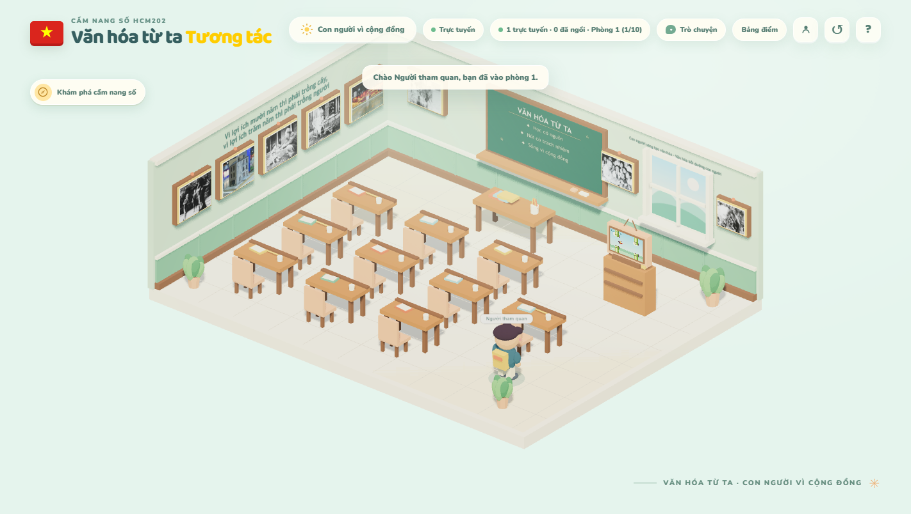

# Văn hóa từ ta

**Lớp học tương tác 3D · HCM202**

*Văn hóa từ ta – Con người vì cộng đồng*

Một không gian học tập 3D chuyển nội dung **“Văn hóa và con người trong tư tưởng Hồ Chí Minh”** thành tám trạm khám phá. Người học chọn nhân vật, di chuyển trong lớp, tìm hiểu tư liệu, trao đổi theo phòng và tham gia bài kiểm tra cùng giảng viên.



<sub>Ảnh chụp từ ứng dụng khi chạy cục bộ.</sub>

**Công nghệ:** Three.js · Vite · Supabase Realtime · PostgreSQL

## Trải nghiệm trong lớp học

| Khám phá | Tương tác | Học cùng nhau |
| --- | --- | --- |
| Tám trạm nội dung, tranh và ảnh tư liệu có liên kết đến nguồn | Chọn avatar, di chuyển, đổi góc nhìn, ngồi vào ghế và chơi quiz | Phòng học tối đa 10 người, chat theo phòng và bài kiểm tra 15 phút |

## Bắt đầu nhanh

**Yêu cầu:** Node.js `^20.19.0` hoặc `>=22.12.0`, npm và một dự án Supabase.

1. Trong Supabase, bật **Anonymous Sign-Ins** tại **Authentication → Providers**.
2. Chạy các tệp trong [`supabase/migrations`](supabase/migrations) theo thứ tự tên tệp nếu tạo cơ sở dữ liệu mới.
3. Tạo `.env` từ [`.env.example`](.env.example), rồi điền URL và **publishable key** của dự án:

   ```dotenv
   VITE_SUPABASE_URL=https://your-project.supabase.co
   VITE_SUPABASE_PUBLISHABLE_KEY=sb_publishable_your_key
   ```

4. Cài đặt và chạy ứng dụng:

   ```bash
   npm ci
   npm run dev
   ```

Mở địa chỉ Vite hiển thị trong terminal. Ứng dụng cũng hỗ trợ tên biến `NEXT_PUBLIC_SUPABASE_URL` và `NEXT_PUBLIC_SUPABASE_PUBLISHABLE_KEY`. Chỉ dùng **publishable key** trên trình duyệt; không đưa `service_role` hoặc secret key vào `.env` của ứng dụng này.

<details>
<summary>Đã có cơ sở dữ liệu từ phiên bản trước?</summary>

Chạy [migration nội dung HCM202](supabase/migrations/20261006_z_hcm202_showcase_content.sql), sau đó chạy [migration điểm vào lớp và trạng thái ghế](supabase/migrations/20261006_zz_spawn_seat_recovery.sql). Migration thứ hai đặt điểm vào lớp ở vùng trống và đưa nhân vật ra lối đi khi đứng dậy.

</details>

## Cách sử dụng

| Thao tác | Điều khiển |
| --- | --- |
| Di chuyển | `W`, `A`, `S`, `D` hoặc phím mũi tên |
| Đổi góc nhìn | Kéo chuột hoặc chạm kéo |
| Phóng to, thu nhỏ | Cuộn chuột hoặc chụm hai ngón |
| Xem nội dung | Nhấp tranh hoặc TV; có thể tới gần rồi nhấn `E` |
| Di chuyển trên điện thoại | Joystick ở góc dưới bên trái |
| Ngồi vào ghế | Tới gần và nhấn `E` hoặc nhấp ghế |

## Phòng học và bài kiểm tra

- Mỗi phòng có tối đa **10 người**, gồm cả giảng viên. Người tham gia tiếp theo được xếp vào phòng mới. Trạng thái 3D, chuyển động và chat được tách theo phòng.
- Tên `NHOM3HCM202AI1802` nhận vai trò giảng viên để trình diễn. Đây là quy ước của dự án, **không phải cơ chế xác thực** cho một kỳ thi chính thức.
- Khi giảng viên mở bài, sinh viên đang ngồi ở tất cả phòng được ghi nhận trong cùng một lượt kiểm tra. Bài có **10 câu**, thời gian tính theo máy chủ; kết quả xếp theo số câu đúng, sau đó theo thời gian nộp.
- Giảng viên có thể kết thúc bài hoặc đặt lại bảng xếp hạng. Chat dùng Realtime Broadcast và giữ tối đa 60 tin trong bộ nhớ của từng trình duyệt; tin nhắn mất khi tải lại, thoát trang hoặc chuyển phòng.

## Lệnh thường dùng

| Lệnh | Mục đích |
| --- | --- |
| `npm run dev` | Chạy bản dùng Supabase trên máy cá nhân |
| `npm run dev:lan` | Chạy bản LAN |
| `npm run build` | Tạo bản phát hành trong `dist/` |
| `npm run preview` | Xem thử bản đã build |
| `npm run test:online` | Kiểm tra migration và luồng thi bằng PGlite |
| `npm run test:lan` | Kiểm tra máy chủ LAN |

### Triển khai trên Vercel

Đặt `VITE_SUPABASE_URL` và `VITE_SUPABASE_PUBLISHABLE_KEY` trong **Project Settings → Environment Variables**. Dùng `npm run build` làm lệnh build và `dist` làm thư mục đầu ra.

## Nguồn nội dung và hình ảnh

Nội dung tám trạm dựa trên bộ thuyết trình và kịch bản của học phần HCM202. Bộ tài liệu gốc không nằm trong repo. Ảnh trong [`public/hcm-gallery`](public/hcm-gallery) được lấy từ các bài viết và không gian trưng bày của Bảo tàng Hồ Chí Minh; từng ảnh trong ứng dụng có liên kết đến trang nguồn.

- [Phong cách làm việc của Chủ tịch Hồ Chí Minh](https://baotanghochiminh.vn/gia-tri-phong-cach-lam-viec-cua-chu-tich-ho-chi-minh-doi-voi-cong-tac-xay-dung-chinh-don-dang-hien-nay.htm)
- [Học tập tấm gương làm việc trách nhiệm, khoa học, đổi mới](https://baotanghochiminh.vn/hoc-tap-tam-guong-lam-viec-trach-nhiem-khoa-hoc-doi-moi-cua-chu-tich-ho-chi-minh.htm)
- [Chủ tịch Hồ Chí Minh càng giản dị càng vĩ đại](https://baotanghochiminh.vn/chu-tich-ho-chi-minh-cang-gian-di-cang-vi-dai.htm)
- [Trưng bày chuyên đề “Hồ Chí Minh – Chân dung một con người”](https://baotanghochiminh.vn/bao-tang-ho-chi-minh-khai-mac-trung-bay-chuyen-de-ho-chi-minh-chan-dung-mot-con-nguoi.htm)

Sprite Flappy Bird có giấy phép MIT tại [`public/flappy/LICENSE`](public/flappy/LICENSE).
